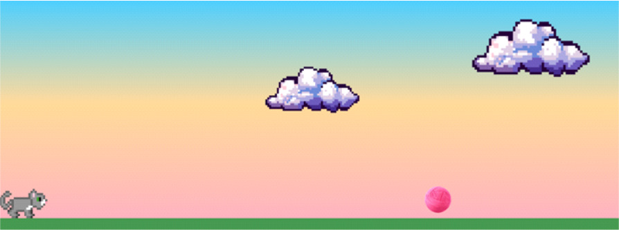
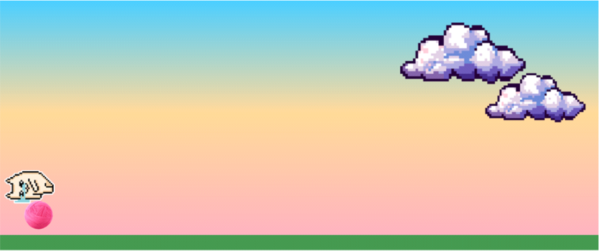

# Practice_project: simple game

 <h1 align="center">
  
Cat Game

  
  
</h1>

- Trata-se de um projeto simples com o objetivo de colocar meus conhecimentos de programação web em prática e desenvolver um jogo web simples.

## Tecnologias

- HTML, CSS e JavaScript

## Desafios enfrentados
